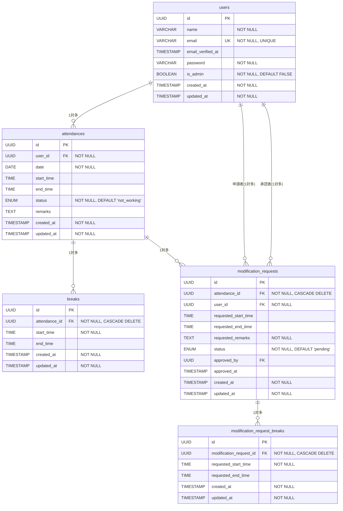

# 勤怠管理システム

## プロジェクトの概要

勤怠管理システムは、Laravel で構築された勤怠管理アプリケーションです。一般ユーザーが勤怠の打刻・確認・修正申請を行い、管理者が勤怠情報の管理・承認を行うプラットフォームを提供します。

### 主な機能

- **一般ユーザー機能**

  - 新規会員登録・ログイン・ログアウト
  - メール認証機能（MailHog/Mailtrap）
  - 勤怠打刻（出勤・休憩・退勤）
  - 勤怠一覧・詳細確認
  - 勤怠修正申請
  - 申請状況確認（承認待ち・承認済み）

- **管理者機能**

  - 管理者ログイン・ログアウト
  - 日次勤怠一覧確認
  - スタッフ一覧・月次勤怠確認
  - 勤怠詳細確認・修正
  - 修正申請承認
  - CSV 出力機能

- **その他**
  - レスポンシブデザイン対応
  - バリデーション機能
  - CI/CD (GitHub Actions)

## 使用技術

### バックエンド

- **PHP** 7.3|8.0
- **Laravel** 8.x
- **MySQL** 8.0.26

### フロントエンド

- **HTML5/CSS3**
- **JavaScript**
- **Blade テンプレートエンジン**

### 認証・メール

- **Laravel Fortify** (認証機能)
- **MailHog/Mailtrap** (メール送信テスト)

### 開発・運用環境

- **Docker** & **Docker Compose**
- **Nginx** 1.21.1
- **PHPMyAdmin** (データベース管理)
- **MailHog** (メール送信テスト)

### 開発ツール

- **PHPStan** (静的解析)
- **PHP CodeSniffer** (コード規約チェック)
- **PHP CS Fixer** (コード整形)
- **PHPUnit** (テスト)

## データベース設計

### ER 図



### テーブル説明

#### 1. users（ユーザー）

- システムのユーザー情報を管理
- 管理者フラグ（is_admin）で権限を制御

#### 2. attendances（勤怠記録）

- 日別の勤怠情報を管理
- ステータス（not_working, working, on_break, finished）で勤務状態を管理

#### 3. breaks（休憩記録）

- 勤怠記録に紐づく休憩時間を管理

#### 4. modification_requests（修正申請）

- 勤怠記録の修正申請を管理
- 申請者と承認者の両方で users テーブルと関連

#### 5. modification_request_breaks（修正申請休憩）

- 修正申請に含まれる休憩時間の修正を管理

### リレーションシップ

1. **users → attendances**: 1 対多（1 人のユーザーは複数の勤怠記録を持つ）
2. **attendances → breaks**: 1 対多（1 つの勤怠記録は複数の休憩記録を持つ）
3. **attendances → modification_requests**: 1 対多（1 つの勤怠記録は複数の修正申請を持つ）
4. **users → modification_requests**: 1 対多（申請者として）
5. **users → modification_requests**: 1 対多（承認者として）
6. **modification_requests → modification_request_breaks**: 1 対多（1 つの修正申請は複数の休憩修正を含む）

### ENUM 値

#### attendances.status

- `not_working`: 勤務外
- `working`: 出勤中
- `on_break`: 休憩中
- `finished`: 退勤済

#### modification_requests.status

- `pending`: 承認待ち
- `approved`: 承認済み

### テーブル仕様書

#### 1. users テーブル（ユーザー）

| カラム名          | データ型     | 制約                    | 説明                     |
| ----------------- | ------------ | ----------------------- | ------------------------ |
| id                | UUID         | PRIMARY KEY             | ユーザー ID              |
| name              | VARCHAR(255) | NOT NULL                | ユーザー名               |
| email             | VARCHAR(255) | NOT NULL, UNIQUE        | メールアドレス           |
| email_verified_at | TIMESTAMP    | NULL                    | メール認証日時           |
| password          | VARCHAR(255) | NOT NULL                | パスワード（ハッシュ化） |
| is_admin          | BOOLEAN      | NOT NULL, DEFAULT FALSE | 管理者フラグ             |
| created_at        | TIMESTAMP    | NOT NULL                | 作成日時                 |
| updated_at        | TIMESTAMP    | NOT NULL                | 更新日時                 |

**インデックス:**

- PRIMARY KEY (id)
- UNIQUE INDEX (email)

#### 2. attendances テーブル（勤怠記録）

| カラム名   | データ型  | 制約                            | 説明        |
| ---------- | --------- | ------------------------------- | ----------- |
| id         | UUID      | PRIMARY KEY                     | 勤怠記録 ID |
| user_id    | UUID      | NOT NULL, FOREIGN KEY           | ユーザー ID |
| date       | DATE      | NOT NULL                        | 勤怠日付    |
| start_time | TIME      | NULL                            | 出勤時刻    |
| end_time   | TIME      | NULL                            | 退勤時刻    |
| status     | ENUM      | NOT NULL, DEFAULT 'not_working' | ステータス  |
| remarks    | TEXT      | NULL                            | 備考        |
| created_at | TIMESTAMP | NOT NULL                        | 作成日時    |
| updated_at | TIMESTAMP | NOT NULL                        | 更新日時    |

**ENUM 値 (status):**

- not_working: 勤務外
- working: 出勤中
- on_break: 休憩中
- finished: 退勤済

**インデックス:**

- PRIMARY KEY (id)
- FOREIGN KEY (user_id) REFERENCES users(id)
- UNIQUE INDEX (user_id, date)
- INDEX (date)

#### 3. breaks テーブル（休憩記録）

| カラム名      | データ型  | 制約                  | 説明         |
| ------------- | --------- | --------------------- | ------------ |
| id            | UUID      | PRIMARY KEY           | 休憩記録 ID  |
| attendance_id | UUID      | NOT NULL, FOREIGN KEY | 勤怠記録 ID  |
| start_time    | TIME      | NOT NULL              | 休憩開始時刻 |
| end_time      | TIME      | NULL                  | 休憩終了時刻 |
| created_at    | TIMESTAMP | NOT NULL              | 作成日時     |
| updated_at    | TIMESTAMP | NOT NULL              | 更新日時     |

**インデックス:**

- PRIMARY KEY (id)
- FOREIGN KEY (attendance_id) REFERENCES attendances(id) ON DELETE CASCADE
- INDEX (attendance_id)

#### 4. modification_requests テーブル（修正申請）

| カラム名             | データ型  | 制約                        | 説明              |
| -------------------- | --------- | --------------------------- | ----------------- |
| id                   | UUID      | PRIMARY KEY                 | 修正申請 ID       |
| attendance_id        | UUID      | NOT NULL, FOREIGN KEY       | 勤怠記録 ID       |
| user_id              | UUID      | NOT NULL, FOREIGN KEY       | 申請者ユーザー ID |
| requested_start_time | TIME      | NULL                        | 申請出勤時刻      |
| requested_end_time   | TIME      | NULL                        | 申請退勤時刻      |
| requested_remarks    | TEXT      | NOT NULL                    | 申請備考          |
| status               | ENUM      | NOT NULL, DEFAULT 'pending' | 承認状態          |
| approved_by          | UUID      | NULL, FOREIGN KEY           | 承認者ユーザー ID |
| approved_at          | TIMESTAMP | NULL                        | 承認日時          |
| created_at           | TIMESTAMP | NOT NULL                    | 申請日時          |
| updated_at           | TIMESTAMP | NOT NULL                    | 更新日時          |

**ENUM 値 (status):**

- pending: 承認待ち
- approved: 承認済み

**インデックス:**

- PRIMARY KEY (id)
- FOREIGN KEY (attendance_id) REFERENCES attendances(id) ON DELETE CASCADE
- FOREIGN KEY (user_id) REFERENCES users(id)
- FOREIGN KEY (approved_by) REFERENCES users(id)
- INDEX (status)
- INDEX (user_id, status)

#### 5. modification_request_breaks テーブル（修正申請休憩）

| カラム名                | データ型  | 制約                  | 説明             |
| ----------------------- | --------- | --------------------- | ---------------- |
| id                      | UUID      | PRIMARY KEY           | 修正申請休憩 ID  |
| modification_request_id | UUID      | NOT NULL, FOREIGN KEY | 修正申請 ID      |
| requested_start_time    | TIME      | NOT NULL              | 申請休憩開始時刻 |
| requested_end_time      | TIME      | NULL                  | 申請休憩終了時刻 |
| created_at              | TIMESTAMP | NOT NULL              | 作成日時         |
| updated_at              | TIMESTAMP | NOT NULL              | 更新日時         |

**インデックス:**

- PRIMARY KEY (id)
- FOREIGN KEY (modification_request_id) REFERENCES modification_requests(id) ON DELETE CASCADE
- INDEX (modification_request_id)

### データ制約・業務ルール

#### attendances テーブル

- 同一ユーザー・同一日付の組み合わせは一意
- start_time < end_time（両方が NULL でない場合）

#### breaks テーブル

- start_time < end_time（end_time が NULL でない場合）
- start_time は対応する attendance の start_time 以降
- end_time は対応する attendance の end_time 以前

#### modification_requests テーブル

- requested_start_time < requested_end_time（両方が NULL でない場合）
- approved_by は管理者ユーザー（is_admin = true）のみ
- status が approved の場合、approved_by と approved_at は必須

#### modification_request_breaks テーブル

- requested_start_time < requested_end_time（requested_end_time が NULL でない場合）

## 環境構築手順

### 前提条件

以下のソフトウェアがインストールされていることを確認してください：

- Docker Desktop
- Docker Compose

### 1. リポジトリのクローン

```bash
# SSHでクローンする場合
git clone git@github.com:hasedai0000/attendance-app.git

# HTTPSでクローンする場合
git clone https://github.com/hasedai0000/attendance-app.git

cd Attendance-app
```

### 2. 環境の起動

```bash
# Dockerコンテナをビルドして起動
docker compose up -d --build
```

### 3. Laravel アプリケーションのセットアップ

```bash
# PHPコンテナに入る
docker compose exec php bash

# 依存関係のインストール
composer install

# 環境設定ファイルのコピー
cp .env.example .env

# アプリケーションキーの生成
php artisan key:generate

# ストレージのシンボリックリンクを作成する
php artisan storage:link

# データベースマイグレーションとシーダーの実行
php artisan migrate:fresh --seed

```

#### 3.1 データベース接続情報

```bash

# .envにDB接続情報の設定
DB_DATABASE=laravel_db
DB_USERNAME=laravel_user
DB_PASSWORD=laravel_pass
DB_HOST=mysql #（コンテナ間通信）

# データベースマイグレーションとシーダーの実行
php artisan migrate:fresh --seed

```

### 4. 動作確認

ブラウザで以下の URL にアクセスして、アプリケーションが正常に動作することを確認してください：

- **アプリケーション**: http://localhost/login
- **PHPMyAdmin**: http://localhost:8080
- **MailHog**: http://localhost:8025

### 5. 2 回目以降の起動

```bash
docker compose up -d
```

## ログイン情報

### 管理者ユーザー

| ユーザー名     | メールアドレス    | パスワード | 状態     |
| -------------- | ----------------- | ---------- | -------- |
| 管理者         | admin@example.com | password   | 認証済み |
| テストユーザー | test@example.com  | password   | 認証済み |

### 一般ユーザー（認証済み）

以下のアカウントでログインできます：

| ユーザー名 | メールアドレス        | パスワード | 状態     |
| ---------- | --------------------- | ---------- | -------- |
| 田中太郎   | tanaka@example.com    | password   | 認証済み |
| 佐藤花子   | sato@example.com      | password   | 認証済み |
| 鈴木美咲   | suzuki@example.com    | password   | 認証済み |
| 高橋健太   | takahashi@example.com | password   | 認証済み |
| 渡辺翔太   | watanabe@example.com  | password   | 認証済み |
| 中村優子   | nakamura@example.com  | password   | 認証済み |
| 小林大輔   | kobayashi@example.com | password   | 認証済み |
| 加藤結衣   | kato@example.com      | password   | 認証済み |
| 森田浩司   | morita@example.com    | password   | 認証済み |
| 松本あかり | matsumoto@example.com | password   | 認証済み |
| 橋本拓也   | hashimoto@example.com | password   | 認証済み |
| 清水恵子   | shimizu@example.com   | password   | 認証済み |

### メール未認証ユーザー

| ユーザー名 | メールアドレス     | パスワード | 状態   |
| ---------- | ------------------ | ---------- | ------ |
| 山田次郎   | yamada@example.com | password   | 未認証 |
| 伊藤愛     | ito@example.com    | password   | 未認証 |

## メール設定

### MailHog の設定

開発環境では MailHog を使用してメール送信をテストできます。

- **MailHog URL**: http://localhost:8025
- **SMTP 設定**: ローカルホストの 1025 ポートを使用

### メール認証機能

- 新規会員登録時にメール認証が送信されます
- メール認証が完了していない場合は、ログイン時に認証誘導画面が表示されます
- 認証メールの再送機能も利用できます

## 開発時の操作

### コンテナの操作

```bash
# コンテナを停止
docker compose stop

# コンテナを停止して削除
docker compose down

# コンテナを再起動
docker compose restart
```

### ログの確認

```bash
# 全サービスのログを確認
docker compose logs

# 特定のサービスのログを確認
docker compose logs nginx
docker compose logs php
docker compose logs mysql
```

### コンテナ内での作業

```bash
# PHPコンテナに入る
docker compose exec php bash

# Nginxコンテナに入る
docker compose exec nginx bash

# MySQLコンテナに入る
docker compose exec mysql bash
```

### MySQL への直接アクセス

```bash
# MySQLコンテナ内でMySQLにログイン
docker compose exec mysql mysql -u laravel_user -p laravel_db
# パスワード: attendance_pass
```

### 開発用コマンド

```bash
# PHPコンテナ内で実行

# マイグレーションの実行
php artisan migrate

# シーダーの実行
php artisan db:seed

# テスト用のDBを作成
docker compose exec mysql mysql -u root -proot -e "CREATE DATABASE IF NOT EXISTS laravel_test;"

# マイグレーション
docker compose exec php php artisan migrate --env=testing

# テストを実行
docker compose exec php php artisan test
```

## CI/CD

このプロジェクトでは GitHub Actions を使用して CI/CD パイプラインを構築しています。

### 自動テスト

プッシュ・プルリクエスト時に以下が自動実行されます：

- **テスト実行**: PHPUnit を使用したユニットテスト・フィーチャーテスト

### マトリックステスト

複数の PHP バージョンでテストを実行：

- PHP 8.0

### ワークフロー

CI 設定ファイル: `.github/workflows/ci.yml`

```bash
# ローカルで同じテストを実行する場合
cd src
composer test      # PHPUnit テストを実行
```

## ファイル構成

```
Attendance-app/
├── docker/                 # Docker設定
│   ├── nginx/
│   │   └── default.conf    # Nginx設定
│   ├── php/
│   │   ├── Dockerfile      # PHP設定
│   │   └── php.ini         # PHP設定
│   └── mysql/
│       └── my.cnf          # MySQL設定
├── src/                    # Laravelアプリケーション
│   ├── app/                # アプリケーションロジック
│   ├── database/           # マイグレーション・シーダー
│   ├── public/             # 公開ファイル
│   ├── resources/          # ビュー・CSS・JS
│   └── routes/             # ルート定義
├── docker-compose.yml      # Docker Compose設定
└── README.md              # このファイル
```

## トラブルシューティング

### ポート競合の場合

ポート 80 が使用中の場合、`docker-compose.yml`を編集：

```yaml
services:
  nginx:
    ports:
      - "8080:80" # ホストの8080ポートを使用
```

アクセス URL: http://localhost:8080

### コンテナが起動しない場合

```bash
# コンテナの状態確認
docker compose ps

# ログでエラー確認
docker compose logs

# 完全にクリーンアップして再構築
docker compose down --volumes --remove-orphans
docker compose up --build
```

### データベース接続エラー

```bash
# PHPコンテナ内で接続確認
docker compose exec php php artisan tinker
DB::connection()->getPdo();
```
